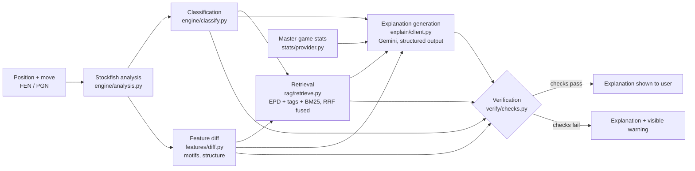

# ChessLens

An explainable chess coach that runs Stockfish analysis, retrieves chess theory, generates a coaching explanation with Gemini, and then mechanically checks every claim in that explanation against the actual board before showing it to you.

## The problem

Ask an LLM to comment on a chess position and it will happily tell you a move creates a fork that isn't there, cites a "principle" that doesn't apply, or claims a line is legal when it isn't. The model is fluent, not grounded. It has no access to the actual board state beyond what's in the prompt, so nothing stops it from inventing a plausible-sounding but false tactical claim. Most engine-plus-commentary tools just trust whatever the model says.

ChessLens doesn't trust it. The explanation Gemini produces is treated as a set of falsifiable claims, and a separate deterministic pass checks each one against the position before it reaches the user.

## How it works

1. **Engine analysis** (`chesslens/engine/`) — Stockfish evaluates the position and the move played, and `classify.py` labels it (book, best, good, inaccuracy, mistake, blunder, only-move) based on the win-probability drop versus the engine's top choice.
2. **Feature extraction** (`chesslens/features/`) — the played move is diffed against the engine's best move. This produces the concrete facts the rest of the pipeline works from: tactical motifs (forks, pins, skewers, discovered attacks/checks, back-rank threats, trapped pieces, overloads, hanging material), static features, and pawn/piece structures.
3. **Master-game context** (`chesslens/stats/`) — a stats provider (Lichess opening explorer or a local PGN-derived table) reports how strong players actually play this position.
4. **Retrieval** (`chesslens/rag/`) — a locally built corpus of chess theory (openings data, Wikibooks, public-domain books) is queried three ways at once: exact position lookup by EPD, structural lookup by motif/structure tags, and BM25 full-text search. The three ranked lists are fused with reciprocal rank fusion so a passage that shows up in more than one channel outranks one that only matches on text.
5. **Explanation** (`chesslens/explain/`) — Gemini generates the coaching explanation from the engine facts, the extracted motifs, the master-game stats, and the retrieved passages. The output is a structured object (`Explanation` in `chesslens/explain/schema.py`), not free text: headline, classification, the objective case for the engine's move, what the played move misses, what masters do, the transferable principle, and, critically, the specific motifs, moves, and sources the explanation actually cites.
6. **Verification** (`chesslens/verify/checks.py`) — a deterministic pass checks the structured explanation against the facts it was given. Nothing here calls a model a second time; it's set membership and chess-legality checks.

An **offline mode** runs the whole pipeline except the Gemini call, producing a deterministic template explanation from the same engine facts. Useful for testing, and for running without an API key.

## What actually gets verified

`verify_explanation()` in `chesslens/verify/checks.py` runs these checks, and only these:

- **Classification match** — the classification the model stated must equal the one `classify.py` computed from the engine's actual centipawn/win-probability numbers.
- **Motif grounding** — every motif tag the explanation cites must be a real motif kind (from a fixed vocabulary: fork, pin, skewer, discovered attack/check, hangs, back-rank weakness/mate threat, trapped, overload), and it must have actually been found in this position by `features/motifs.py`, either in the best line or the line played.
- **Move legality** — every move (in SAN) the explanation cites must be a legal move either in the position being analysed, or in the position one ply later after the move actually played, since coaching prose often describes a follow-up threat that's only legal after a reply.
- **Source grounding** — every citation id the explanation lists must be an id that was actually in the retrieved set for this position, not an invented reference.
- **Consistency of "what your move misses"** — this field must be null when the played move was as good as the engine's best (best/book/only-move), and must be non-null otherwise. The check keys off the computed classification, not naive move equality, because a played move can be classified as good as best without being the literal same move object.

A failed check doesn't get silently dropped. It's returned as a specific error string and surfaces as a visible warning rather than letting an unverifiable claim pass as fact.

## What this does not verify

The checks above are about grounding, not truth in general. The verifier confirms a cited motif was detected and a cited move is legal; it does not check that the model's prose *reasoning* about why the motif matters is correct, that the "principle" text is sound chess advice, or that the retrieved sources are actually relevant rather than just present in the retrieved set. A model could describe a real, present fork badly and still pass verification. Verification catches invented facts, not bad explanations of real ones.

## Testing

`pytest -q` runs 65 tests covering engine classification, motif and structure detection, move diffing, retrieval (including the RRF fusion logic), corpus storage, stats providers, and the verification layer itself (`tests/test_verify.py`). 62 of the 65 run without any external dependency; the remaining 3, in `tests/test_engine.py`, drive a real Stockfish process and need a binary set up via `scripts/setup_stockfish.py` or `STOCKFISH_PATH`.

There's also `scripts/eval.py`, a held-out set of hand-built positions with known expected motifs and classifications, run against the real pipeline to report motif recall/precision, classification accuracy, and verifier pass rate. It exists specifically because, as the script's own docstring puts it, most engine-plus-LLM coaching projects have no number to iterate against. That said, no eval results are checked into this repo, and explanation quality/accuracy in the "does Gemini's prose reasoning make chess sense" sense has not been formally measured. What's verified mechanically is grounding (motifs present, moves legal, sources real, classification correct), not the soundness of the model's written reasoning.

## Architecture



Generation and verification are separate stages by design: `explain/client.py` never sees the verifier, and `verify/checks.py` never calls a model. The verifier only sees the same structured facts (classification, diff, retrieval results) that were handed to the generator, plus the generator's structured output, so it can check the two against each other independently of how either was produced.

## Limitations

- Verification checks grounding, not quality. See "What this does not verify" above.
- The motif vocabulary is fixed and fairly small (10 kinds). Real tactical ideas outside that vocabulary can't be cited in a way the verifier would recognize as grounded, so the explanation either omits them or the check flags them as ungrounded.
- The RAG corpus is whatever `scripts/build_corpus.py` pulls in: openings data, Wikibooks chess content, and public-domain book chunks. It's not a comprehensive chess-theory library, and retrieval quality depends entirely on what's in that corpus.
- The explanation step needs a Gemini API key and a live network call outside offline mode; offline mode trades that dependency for a fixed template rather than a generated one.
- Stats context depends on the Lichess opening explorer or a local PGN table; positions outside either source's coverage get no master-game context.
- No formal measurement of explanation quality exists beyond the mechanical verification pass rate; see Testing above.

## Install

```bash
pip install -e ".[dev]"
python scripts/setup_stockfish.py    # downloads and verifies a Stockfish binary into data/stockfish/
python scripts/build_corpus.py       # builds the RAG corpus into data/corpus.db
pytest -q                            # 65 tests
```

Copy `.env.example` to `.env` and set `GEMINI_API_KEY` (required for the explain step outside offline mode). `LICHESS_TOKEN`, `LICHESS_USERNAME`, and `CHESSCOM_USERNAME` are optional, for the Lichess-explorer stats provider and the `fetch` command.

## Usage

**Streamlit app**, two tabs, explain a single move or review a whole game from an uploaded PGN:

```bash
streamlit run app.py
```

**CLI**, same functionality:

```bash
chesslens explain "<FEN>" --move Nf3 [--offline]
chesslens review path/to/game.pgn [--offline] [--max N]
chesslens fetch <username> --site lichess|chesscom [--max N] [--out PATH]
```

`fetch` downloads your own recent games as a PGN file, for use as review targets.

## Evaluation

```bash
python scripts/eval.py           # offline templates
python scripts/eval.py --live    # real Gemini calls, spends API quota
```

Reports motif recall/precision, classification accuracy, and verifier pass rate against a held-out set of hand-built positions in `scripts/eval.py`.

## License

MIT
